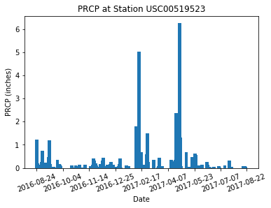
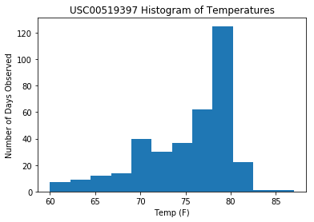
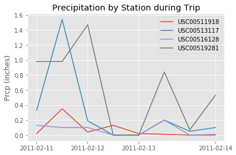
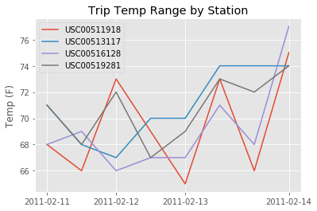
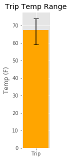

# Hawaii or Bust
Im planning a trip to Hawaii so I naturally want to know what the weather will be like, because, if the weather's bad, then whats the point.   
I want to go sometime in mid 2017.
So lets look at the weather the year before my trip!

# NOAA data
NOAA data from various weather stations around Hawaii provide data on temperature and precipitation.

 # Results
 Prcp for the last year   
    
    
    
 Typical high temperatures   
      
    

 Precipitation for Trip Dates   
      
   
   
 Temperatures for Trip Dates   
     
     
   
 Avg, max, and min temp for Trip Dates   
     

# But don't take my word for it
Flask app included with the following endpoints:   
* `/api/v1.0/precipitation`

  * Query for the dates and temperature observations from the last year.

  * Convert the query results to a Dictionary using `date` as the key and `tobs` as the value.

  * Return the json representation of your dictionary.

* `/api/v1.0/stations`

  * Return a json list of stations from the dataset.

* `/api/v1.0/tobs`

  * Return a json list of Temperature Observations (tobs) for the previous year

* `/api/v1.0/<start>` and `/api/v1.0/<start>/<end>`

  * Return a json list of the minimum temperature, the average temperature, and the max temperature for a given start or start-end range.

  * When given the start only, calculate `TMIN`, `TAVG`, and `TMAX` for all dates greater than and equal to the start date.

  * When given the start and the end date, calculate the `TMIN`, `TAVG`, and `TMAX` for dates between the start and end date inclusive.